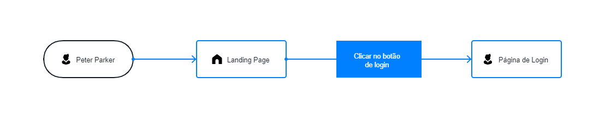
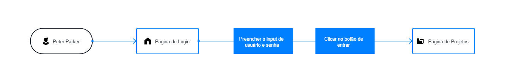
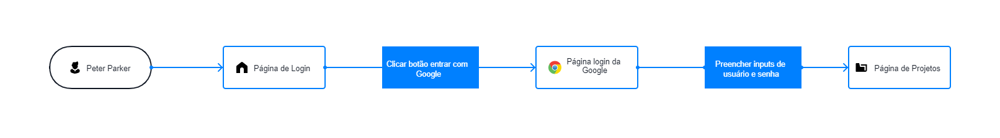
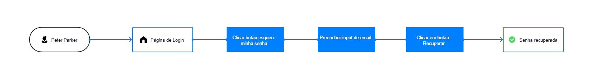
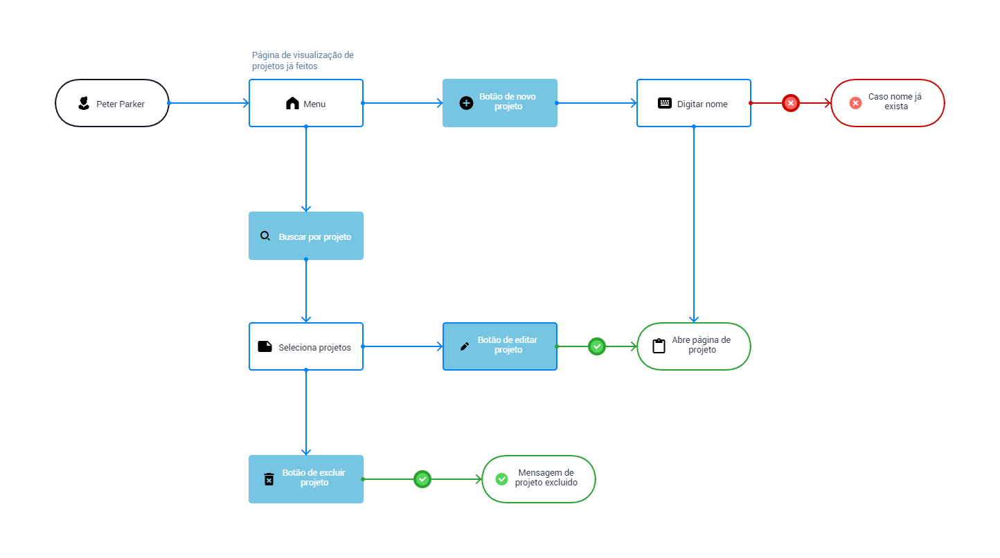
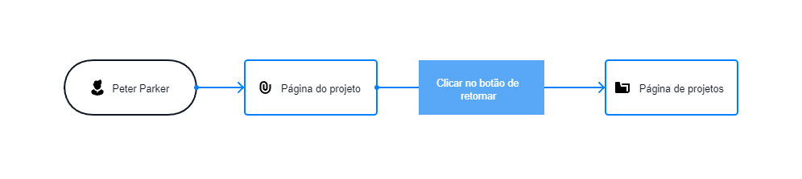
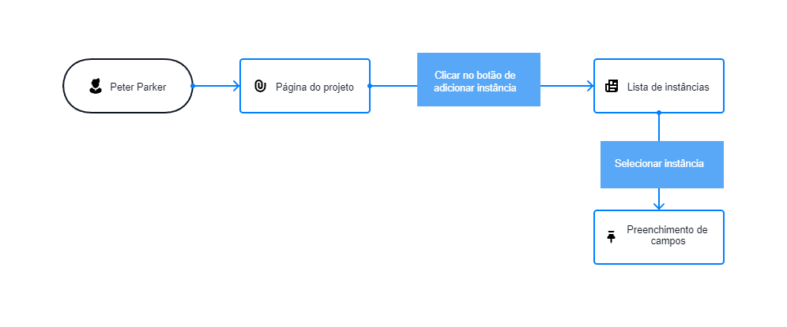
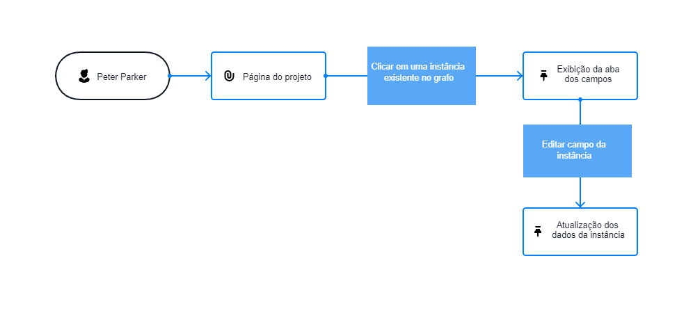

# User FLow

## Cadastro (Gabriel, Esther)

- Acessar landing page e navegar pela opção de cadastro (Gabriel)
  
- Realizar cadastro de um novo usuário (Gabriel)
  
- Ler informações sobre autorização de cadastro, pois exige confirmação do email e outros (Esther)

## Login (Pedro)

- Acessar landing page e navegar pela opção de login

- Realizar login do usuário (via username, password)

- Realizar login do usuário (via conta google)

- Recuperar senha

## Página de projetos (Layane)

- Selecionar um projeto existente
- Buscar por projeto
- Criar um novo projeto
- Apagar projeto existente
- Editar as informações de um projeto existente

## Página do projeto aberto (João Mário, Pedro)

- Retornar para a página de projetos

- Adicionar nova instância ao projeto

- Editar informações de uma instância

- exportar projeto (Pedro)

- visualização do histórico de edição (Pedro)

